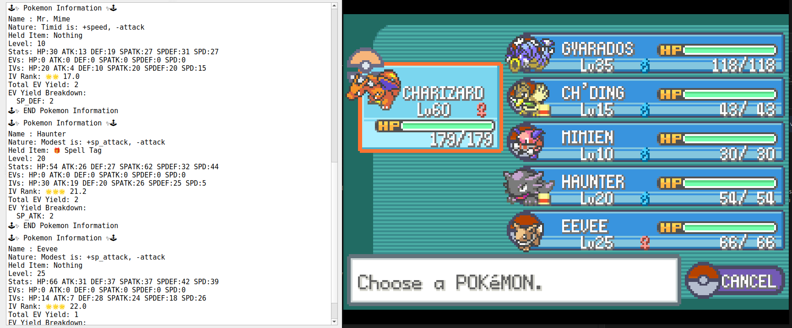

# Pokémon FireRed Lua Scripts

## Overview

These scripts are designed for mGBA emulator and only read information from the game. They do not modify, affect, or hack the game in any way.

## Supported Scripts

### 1. check_all_party.lua
- Reads and displays detailed information about all Pokémon in your party (stats, nature, held item, IVs, EVs, etc.).
- For reviewing your party or checking for good IVs/natures.
- **Does not change any game data.**

### 2. walk_pkm.lua
- Automatically detects wild Pokémon encounters and displays detailed information (stats, nature, IVs, EVs, etc.).
- Useful for quickly checking wild Pokémon details during gameplay.
- **Does not change any game data.**

**Note:**
- Only works in mGBA emulator with Lua scripting enabled.
- Scripts are for information purposes only and do not interact with or alter the game.

---

# Pokémon FireRed Lua Scripts
## Giới thiệu

Các script này được thiết kế cho giả lập mGBA và chỉ dùng để đọc thông tin từ game. Script KHÔNG chỉnh sửa, tác động hay hack game.

## Các script hỗ trợ

### 1. check_all_party.lua
- Đọc và hiển thị thông tin chi tiết của tất cả Pokémon trong party (chỉ số, nature, item cầm, IVs, EVs,...).
- Dùng để kiểm tra party hoặc săn IV/nature đẹp.
- **Không thay đổi dữ liệu game.**

### 2. walk_pkm.lua
- Tự động phát hiện khi gặp Pokémon hoang dã và hiển thị thông tin chi tiết (chỉ số, nature, IVs, EVs,...).
- Hữu ích để kiểm tra nhanh thông tin Pokémon hoang dã khi chơi.
- **Không thay đổi dữ liệu game.**

**Lưu ý:**
- Chỉ hoạt động trên giả lập mGBA có hỗ trợ Lua scripting.
- Script chỉ dùng để xem thông tin, không can thiệp hay thay đổi game.
- Wild Pokémon info will be printed to the console on each new encounter.

